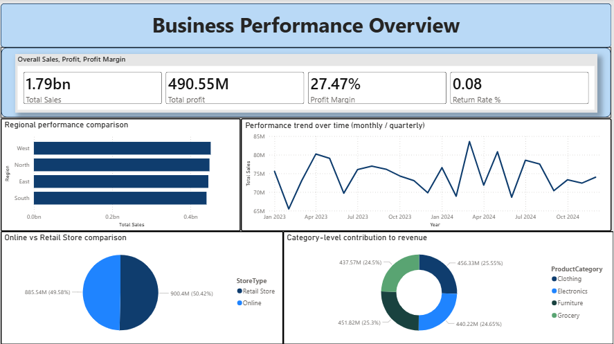

# 📊 Business Performance Analysis Dashboard

## 📌 Overview
This project showcases a **Business Performance Analysis Dashboard** built using Power BI.  
It focuses on visualizing business data to uncover insights related to sales, customer behavior, and operations.

The dashboard is designed to help in understanding trends, comparing performance, and supporting data-driven decision-making.

---

## 🎯 Key Features
- Interactive dashboard with multiple visualizations  
- Sales and performance analysis  
- Customer segmentation insights  
- Trend analysis over time  
- Operational metrics visualization  

---

## 📷 Dashboard Preview

### 🔹 Business Performance Overview

### 🔹 Customer & Operations Insights

---

## 🛠️ Tools Used
- Power BI  
- Data Visualization  
- Data Analysis  

---

## 📁 Project Files
- Power BI dashboard file (`.pbix`)  
- Dashboard screenshots  

---

## 🚀 How to Use
1. Download the `.pbix` file  
2. Open it in Power BI Desktop  
3. Explore the dashboard using filters and visuals  

---

## 🔗 GitHub Repository
https://github.com/om-patel-83/Business-Performance-Analysis-Dashboard

---

## 🙌 Conclusion
This project demonstrates how data visualization can be used to transform raw data into meaningful insights for better business understanding.

---

⭐ If you found this useful, consider giving it a star!
